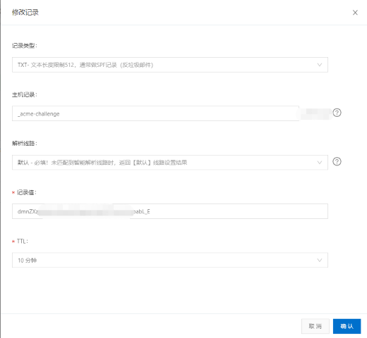

# Certbot

> let’s encrypt 官方推荐的证书生成器

## 安装

```bash
$ sudo apt install certbot
```

## 执行

手动生成 `.pem` 格式的证书

```bash
$ sudo certbot certonly --manual --preferred-challenges=dns-01

## 邮箱验证
Saving debug log to /var/log/letsencrypt/letsencrypt.log
Plugins selected: Authenticator manual, Installer None
Enter email address (used for urgent renewal and security notices) (Enter 'c' to
cancel): XXX@XX.com

## 协议确认
- - - - - - - - - - - - - - - - - - - - - - - - - - - - - - - - - - - - - - - -
Please read the Terms of Service at
https://letsencrypt.org/documents/LE-SA-v1.2-November-15-2017.pdf. You must
agree in order to register with the ACME server at
https://acme-v02.api.letsencrypt.org/directory
- - - - - - - - - - - - - - - - - - - - - - - - - - - - - - - - - - - - - - - -
(A)gree/(C)ancel: A

## 活动订阅
- - - - - - - - - - - - - - - - - - - - - - - - - - - - - - - - - - - - - - - -
Would you be willing to share your email address with the Electronic Frontier
Foundation, a founding partner of the Let's Encrypt project and the non-profit
organization that develops Certbot? We'd like to send you email about our work
encrypting the web, EFF news, campaigns, and ways to support digital freedom.
- - - - - - - - - - - - - - - - - - - - - - - - - - - - - - - - - - - - - - - -
(Y)es/(N)o: N

## 输入域名
Please enter in your domain name(s) (comma and/or space separated)  (Enter 'c'
to cancel): example.com, *.example.com

## ip 解析提示
- - - - - - - - - - - - - - - - - - - - - - - - - - - - - - - - - - - - - - - -
NOTE: The IP of this machine will be publicly logged as having requested this
certificate. If you're running certbot in manual mode on a machine that is not
your server, please ensure you're okay with that.

Are you OK with your IP being logged?
- - - - - - - - - - - - - - - - - - - - - - - - - - - - - - - - - - - - - - - -
(Y)es/(N)o: Y

## 设置 dns 解析，并且校验。
- - - - - - - - - - - - - - - - - - - - - - - - - - - - - - - - - - - - - - - -
Please deploy a DNS TXT record under the name
_acme-challenge.example.com with the following value:

FvMdm......6scC4

Before continuing, verify the record is deployed.
- - - - - - - - - - - - - - - - - - - - - - - - - - - - - - - - - - - - - - - -
Press Enter to Continue

- - - - - - - - - - - - - - - - - - - - - - - - - - - - - - - - - - - - - - - -
Please deploy a DNS TXT record under the name
_acme-challenge.example.com with the following value:

H1UHs......Lc90en4dY

Before continuing, verify the record is deployed.
- - - - - - - - - - - - - - - - - - - - - - - - - - - - - - - - - - - - - - - -

## 成功生成 fullchain.pem（证书）、privkey.pem（证书的秘钥）
Press Enter to Continue
Waiting for verification...
Cleaning up challenges

IMPORTANT NOTES:
 - Congratulations! Your certificate and chain have been saved at:
   /etc/letsencrypt/live/example.com/fullchain.pem
   Your key file has been saved at:
   /etc/letsencrypt/live/example.com/privkey.pem
   Your cert will expire on 2019-01-10. To obtain a new or tweaked
   version of this certificate in the future, simply run certbot
   again. To non-interactively renew *all* of your certificates, run
   "certbot renew"
 - Your account credentials have been saved in your Certbot
   configuration directory at /etc/letsencrypt. You should make a
   secure backup of this folder now. This configuration directory will
   also contain certificates and private keys obtained by Certbot so
   making regular backups of this folder is ideal.
 - If you like Certbot, please consider supporting our work by:

   Donating to ISRG / Let's Encrypt:   https://letsencrypt.org/donate
   Donating to EFF:                    https://eff.org/donate-le
```
设置 dns 解析，并且校验,如图。

